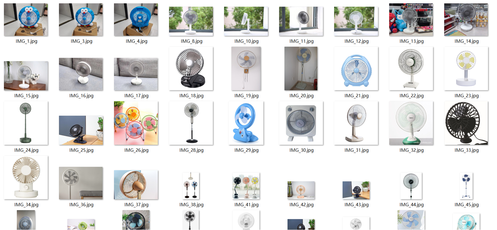
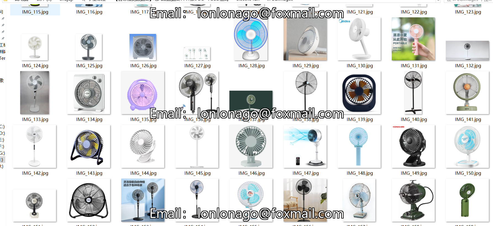

# [Object Detection Dataset] Electric Wind fan Dataset 1141 imagesVOC+YOLO format

Dataset Description: ~

This product is a dataset of electric fan detection for home use, which is labeled by myself with the labelImg tool, and has one category named 'electric fan'. It is in VOC format and contains 1141 images that can be used for the detection of electric fans with the YOLO algorithm.

## Images

---

Here is a pay link on Stripe (https://buy.stripe.com/3cs8yP7sY87d0vu9AB). Please contact me lonlonago@foxmail.com after funding $89, and I will send you a complete data files, thank you!

